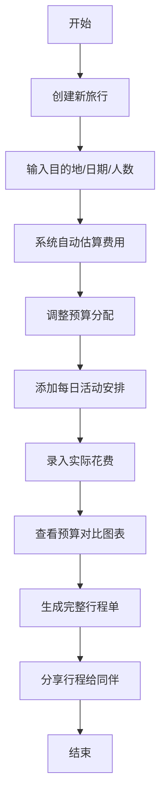

## 1. 产品概述

旅行路线规划和预算追踪软件，帮助用户高效规划旅行行程、管理旅行预算，实现预算与实际花费的可视化对比。

- 主要目的：为旅行者提供一站式行程规划和预算管理解决方案，解决旅行前规划繁琐、旅行中预算失控、旅行后账目不清等痛点
- 目标用户：自助游爱好者、家庭出行用户、商务旅行者
- 产品价值：通过智能费用估算、可视化预算对比、清晰的行程单展示，让旅行规划更轻松、消费更透明

## 2. 核心功能

### 2.1 用户角色

| 角色 | 注册方式 | 核心权限 |
|------|----------|----------|
| 普通用户 | 无需注册，本地存储数据 | 创建/编辑/删除旅行、管理预算、规划行程、生成行程单、分享行程 |

### 2.2 功能模块

1. **旅行管理首页**：旅行列表展示、快速创建新旅行、旅行卡片概览
2. **预算追踪页面**：费用估算、实际花费录入、预算对比图表、分类统计
3. **行程规划页面**：每日活动安排、时间线展示、地点和备注管理
4. **行程单页面**：行程单自动生成、格式化展示、分享功能

### 2.3 页面详情

| 页面名称 | 模块名称 | 功能描述 |
|----------|----------|----------|
| 旅行管理首页 | 旅行列表 | 展示所有旅行卡片，包含目的地、日期、预算概览、进度状态 |
| 旅行管理首页 | 创建旅行 | 表单输入目的地、出发日期、返回日期、旅行人数、预算偏好 |
| 预算追踪页面 | 费用估算 | 根据目的地、天数、人数自动估算交通、住宿、餐饮、门票、其他费用 |
| 预算追踪页面 | 实际花费 | 手动录入各项实际支出，支持按分类和日期筛选 |
| 预算追踪页面 | 预算对比 | 柱状图和饼图展示预算 vs 实际花费，分类支出占比分析 |
| 行程规划页面 | 活动管理 | 添加/编辑/删除每日活动，包含地点、时间、活动描述、备注 |
| 行程规划页面 | 时间线展示 | 按日期和时间顺序展示活动，清晰呈现每日行程 |
| 行程单页面 | 行程单生成 | 自动整合旅行信息、预算概览、每日行程生成格式化行程单 |
| 行程单页面 | 分享功能 | 支持复制分享链接、导出行程单图片或文本格式 |

## 3. 核心流程

用户创建新旅行，填写目的地和日期后，系统自动生成费用估算。用户可调整预算、录入实际花费，查看预算对比分析。同时，用户添加每日活动安排，系统生成完整行程单，最终可分享给同伴。

## 4. 用户界面设计

### 4.1 设计风格

采用**旅行度假主题**的清新自然风格：
- **主色调**：海蓝色 (#1E88E5) 代表天空和海洋，搭配珊瑚橙 (#FF7043) 作为强调色
- **辅助色**：薄荷绿 (#4DB6AC)、阳光黄 (#FFD54F)、薰衣草紫 (#9575CD)
- **整体氛围**：轻松、愉悦、充满探索感，唤起用户对旅行的期待
- **按钮风格**：圆角胶囊按钮，带有微妙悬停动画和阴影效果
- **字体选择**：标题使用 'Poppins' 现代无衬线字体，正文使用 'Noto Sans SC' 支持中文
- **布局风格**：卡片式布局，柔和阴影，圆角设计，留白充足
- **图标风格**：线性图标配合彩色填充，使用旅行相关元素（飞机、酒店、地图、相机等）

### 4.2 页面设计概述

| 页面名称 | 模块名称 | UI 元素 |
|----------|----------|---------|
| 旅行管理首页 | 顶部导航 | Logo、标题、快捷操作按钮、渐变背景 |
| 旅行管理首页 | 旅行卡片 | 目的地大图、日期标签、预算进度条、状态徽章 |
| 旅行管理首页 | 创建旅行表单 | 分步引导式表单，日期选择器，人数选择器 |
| 预算追踪页面 | 预算概览 | 大数字展示总预算、已花费、剩余预算，环形进度图 |
| 预算追踪页面 | 费用分类卡片 | 各分类预算 vs 实际对比条形图，颜色区分 |
| 预算追踪页面 | 图表区域 | Chart.js 柱状图对比、饼图分类占比 |
| 预算追踪页面 | 花费记录列表 | 时间顺序展示，支持分类筛选 |
| 行程规划页面 | 日期选择器 | 横向滚动日期条，选中日期高亮 |
| 行程规划页面 | 时间线 | 左侧时间轴，右侧活动卡片，支持拖拽排序 |
| 行程规划页面 | 添加活动面板 | 地点输入、时间选择、活动类型、备注字段 |
| 行程单页面 | 行程单预览 | 精美卡片式布局，旅行概览、每日行程、预算汇总 |
| 行程单页面 | 分享工具栏 | 复制链接、导出图片、生成二维码 |

### 4.3 响应式设计

采用桌面优先设计，同时完美适配移动端：
- **桌面端（>1024px）**：多列布局，充分利用屏幕空间，侧边导航
- **平板端（768-1024px）**：两列布局，顶部导航，适当压缩间距
- **移动端（<768px）**：单列布局，底部导航栏，大触摸区域，简化表单
- **触摸优化**：所有交互元素最小尺寸 44x44px，支持滑动操作

### 4.4 动画与交互

- **页面加载**：元素从下至上渐入，带有微妙的延迟错位效果
- **卡片悬停**：轻微上浮 + 阴影加深 + 背景光效
- **按钮交互**：点击时缩放反馈，颜色渐变过渡
- **图表动画**：数据加载时的动态绘制效果
- **时间线**：活动添加时的滑入动画，日期切换的淡入淡出
- **状态变化**：预算超支时的颜色渐变警告动画
