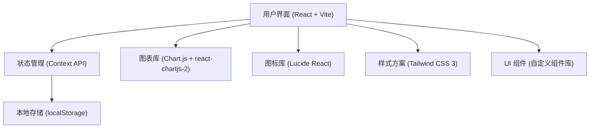
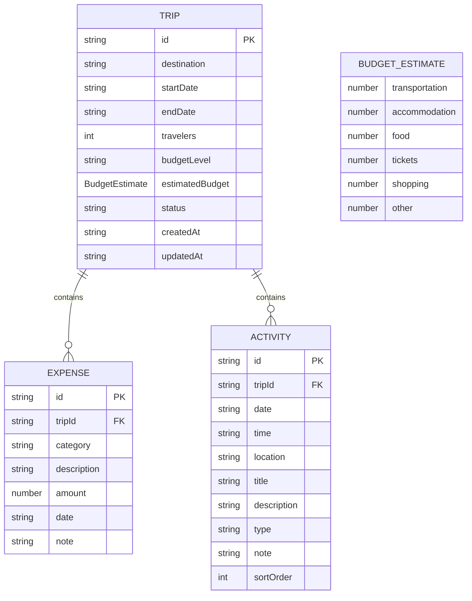

## 1. 架构设计

本项目采用纯前端架构，数据本地存储，无需后端服务。



## 2. 技术描述

- **前端框架**: React@18 + TypeScript + Vite@5
- **样式方案**: Tailwind CSS@3 + CSS 变量
- **图表库**: Chart.js@4 + react-chartjs-2@5
- **图标库**: Lucide React@0.344
- **状态管理**: React Context API + useReducer
- **数据存储**: localStorage 本地持久化
- **日期处理**: date-fns@3
- **路由**: React Router DOM@6
- **代码规范**: ESLint + Prettier

## 3. 路由定义

| 路由路径 | 页面组件 | 用途 |
|----------|----------|------|
| `/` | TripListPage | 旅行管理首页，展示所有旅行列表 |
| `/trip/new` | CreateTripPage | 创建新旅行表单页面 |
| `/trip/:id/budget` | BudgetPage | 预算追踪页面，费用估算和实际花费 |
| `/trip/:id/itinerary` | ItineraryPage | 行程规划页面，每日活动管理 |
| `/trip/:id/plan` | PlanPage | 行程单页面，生成和分享功能 |

## 4. 数据模型

### 4.1 数据模型定义



### 4.2 类型定义

```typescript
// 旅行状态
type TripStatus = 'planning' | 'ongoing' | 'completed';

// 费用分类
type ExpenseCategory = 'transportation' | 'accommodation' | 'food' | 'tickets' | 'shopping' | 'other';

// 活动类型
type ActivityType = 'sightseeing' | 'food' | 'transportation' | 'shopping' | 'entertainment' | 'other';

// 预算估算
interface BudgetEstimate {
  transportation: number;
  accommodation: number;
  food: number;
  tickets: number;
  shopping: number;
  other: number;
}

// 旅行
interface Trip {
  id: string;
  destination: string;
  startDate: string;
  endDate: string;
  travelers: number;
  budgetLevel: 'economy' | 'comfortable' | 'luxury';
  estimatedBudget: BudgetEstimate;
  status: TripStatus;
  createdAt: string;
  updatedAt: string;
}

// 实际花费
interface Expense {
  id: string;
  tripId: string;
  category: ExpenseCategory;
  description: string;
  amount: number;
  date: string;
  note?: string;
}

// 活动安排
interface Activity {
  id: string;
  tripId: string;
  date: string;
  time: string;
  location: string;
  title: string;
  description?: string;
  type: ActivityType;
  note?: string;
  sortOrder: number;
}
```

## 5. 项目目录结构

```
src/
├── components/          # 可复用组件
│   ├── layout/         # 布局组件 (Header, Sidebar, Layout)
│   ├── ui/             # 基础UI组件 (Button, Input, Card, Modal)
│   ├── charts/         # 图表组件
│   └── features/       # 业务组件
├── pages/              # 页面组件
│   ├── TripListPage.tsx
│   ├── CreateTripPage.tsx
│   ├── BudgetPage.tsx
│   ├── ItineraryPage.tsx
│   └── PlanPage.tsx
├── context/            # Context 状态管理
│   ├── TripContext.tsx
│   └── types.ts
├── hooks/              # 自定义 Hooks
│   ├── useLocalStorage.ts
│   ├── useTripBudget.ts
│   └── useDateUtils.ts
├── utils/              # 工具函数
│   ├── budgetCalculator.ts   # 预算估算算法
│   ├── dateUtils.ts
│   ├── shareUtils.ts        # 分享功能
│   └── mockData.ts          # 模拟数据
├── types/              # TypeScript 类型定义
│   └── index.ts
├── App.tsx
├── main.tsx
└── index.css           # 全局样式和 Tailwind 配置
```

## 6. 核心模块说明

### 6.1 预算估算算法

根据目的地类型、旅行天数、人数、预算级别自动计算各项费用：

- **经济型 (economy)**: 人均每天 300-500 元
- **舒适型 (comfortable)**: 人均每天 600-1000 元  
- **豪华型 (luxury)**: 人均每天 1200-2000 元

费用分配比例（可调整）：
- 交通：25%
- 住宿：30%
- 餐饮：20%
- 门票：15%
- 购物：5%
- 其他：5%

### 6.2 状态管理

使用 React Context + useReducer 管理全局状态：

- `TripContext`: 管理旅行、费用、活动数据
- Action 类型: `ADD_TRIP`, `UPDATE_TRIP`, `DELETE_TRIP`, `ADD_EXPENSE`, `UPDATE_EXPENSE`, `DELETE_EXPENSE`, `ADD_ACTIVITY`, `UPDATE_ACTIVITY`, `DELETE_ACTIVITY`

### 6.3 分享功能

实现方式：
1. **复制链接**: 将旅行数据编码为 Base64 附加到 URL 参数
2. **导出行程单**: 生成格式化文本，支持一键复制
3. **生成分享码**: 生成短码，本地存储映射关系

### 6.4 图表配置

使用 Chart.js 实现：
- **柱状图**: 预算 vs 实际花费对比（按分类）
- **饼图**: 各项支出占比分析
- **折线图**: 每日花费趋势

## 7. 关键技术决策

1. **为什么不使用后端？**: 产品定位为个人工具，本地存储足够满足需求，降低复杂度
2. **为什么使用 Context 而非 Redux？**: 应用规模适中，Context API 足够且更简洁
3. **为什么使用 Tailwind CSS？**: 快速开发，一致的设计系统，响应式支持好
4. **为什么使用 Chart.js？**: 轻量级，React 集成好，满足所有图表需求
